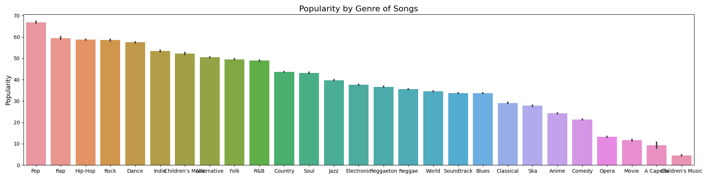
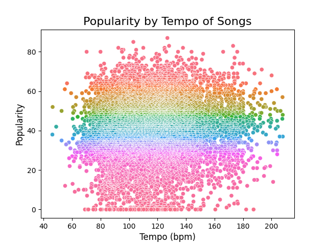
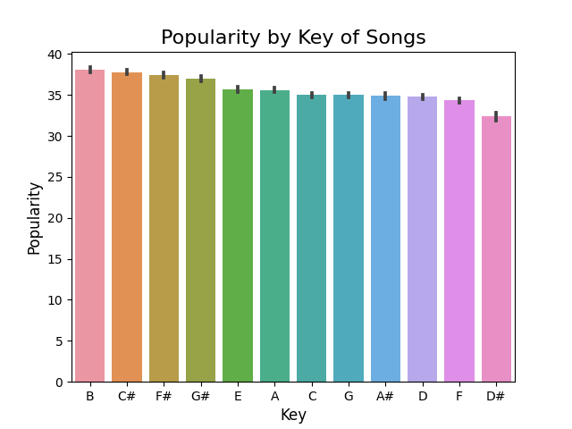
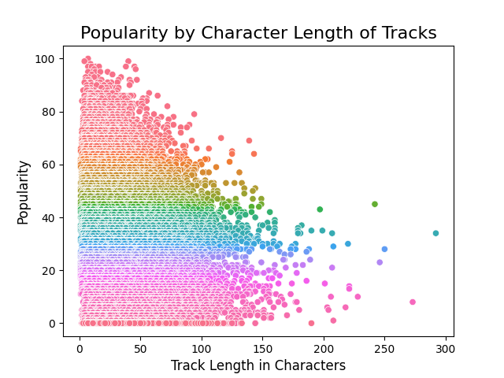
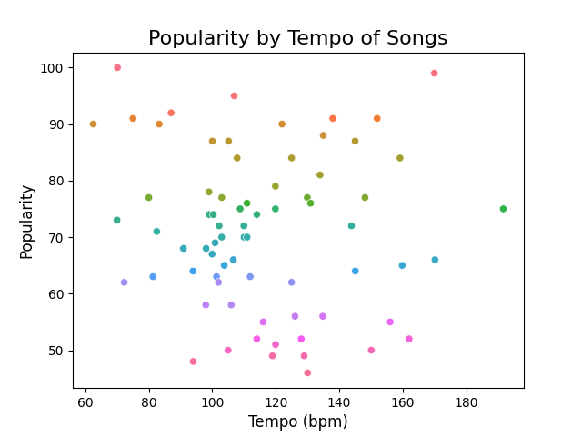
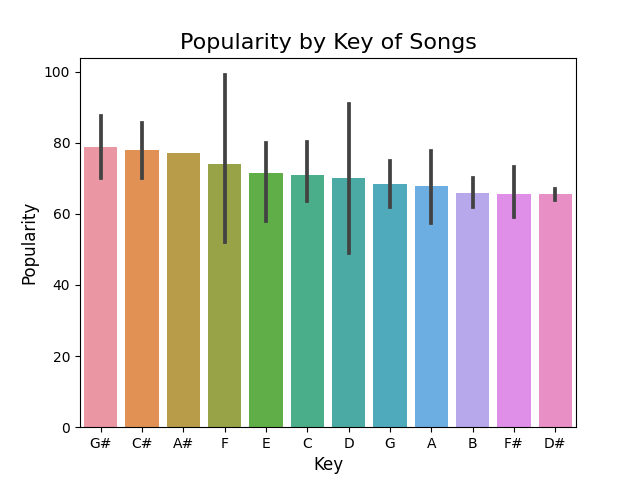

# DS-Individual-Project (SPOTIFY)

## Introduction

The objective of this project is to find what types of attribute make popular and successful songs. And how we can use that to our advantage to create and choose those attributes to try to create a hit song. I was particularly curious about using spotify data and working with a music centric dataset beacuse I am a big music fan and was curious about these types of statistics. 
```
Question: What is the best tempo (bpm) to create a successful song to?
```
```
Hypthesis: The best bpm to create a successful song to will be around 120 bpm, due to the rise in hip-hop and faster paced pop music being so popular now.
```
Purpose:
We want to create a succesful song and are looking at data from a large dataset of songs to conduct research on 'what makes a good song'.

## Selection of Data
Any munging, imputation, or feature engineering?

The data used for research on this project was sourced from [kaggle](https://www.kaggle.com/datasets/zaheenhamidani/ultimate-spotify-tracks-db) [1]. 

This data has over 14,000 entries from spotify. Including 18 features, of which we are focused on:
```
'genre', 'artist_name', 'track_name', 'popularity', 'duration_ms', 'key', 'tempo'
```
We will be using 'popularity' as our main source of metric, as we want to figure out how to create the most succesful/popular song.

Due to songs being able to be put in multiple different genres at the same time, for example: a song falling into both rap & hip/hop genre there were multiple duplicate entires that needed to be taken care of. Thus, first thing that was done was to deprecate all the duplicate data from the dataset.

## Methods

Tools:
- Numpy
- Pandas
- Seaborn
- Matplotlib

Materials:
- Jupyter Notebooks
- PyCharm IDE
- Documentation Refrences [2] [3]

## Results

- First we look at the genres that are most popular on spotify on average


Here we can see that pop rap and hip hop all fall in the top 3 genres.

- Next we take a look at the popularity of songs based on temp


Due to the vast number of samples there is a dense amount of dots in the middle of the graph around the 40-50% popularity mark, indicating the 'average'. However, if we want to look at the top of the top we can see that a lot of these converge around the 110-130 bpm mark with over 70 popularity.

- While we are trying to find characteristcs that make up a song we may even look at songs and the key they were made in.


There seems to be that much variance in the key field as all of the keys are between on average 35-37.5 popularity. We will compare most of this data with a specific artist next to make sure to rationalize our observations.

- Another thing to characterize a song, is song name length as this is ultimately the text a listener will click on


Seeing this there can be seen a skew left graph that converges to the top with the most popular being shorter length naems for songs. 

- Now to test this against a specifc artist to rationalize our observation. I choose to pick Ariana Grande as she is a pop singer and a succesful artist who is in the  top category in the charts and to try to see if any of our observations line with her music. We first can check tempo vs popularity for Ariana Grande and due to only having a handful of songs from her there is less sample data, but we can still analyze it. 


There is a lot of variance that can be seen from the dots on the graph, however if you look closely you can see a pretty big cluster towards the 100-110 bpm mark for her. Singifying that most of the music she makes and is succesful is around this mark.

- Another category we can look at for Ariana Grande specifcally is with the key notes used in her song.


Here there is a little more variance than the general dataset comparison. However, it can still be seen that D# is the lowest used key in her songs and it is on average in all songs. Including other keys being varied due to the data being so close together.

- There are a few more images in the repo that are not used that can be seen for more information on this subject.

- Using these observations we can try to pick and choose our categories for a successful song for ourselves.
```
Tempo: 115 bpm
Key: Any
Song name length: 15 characters
```
These are some of the takeaways that can be seen from the observations above, as with tempo there are big clusters around that average ~120 bpm mark and with seeing Ariana Grande being part of the most popular genre category we can see that her most popular bpm songs are ~110 bpm. Thus we can take the average of those two and try to choose 115 bpm as our tempo for our song.

## Discussion
What might the answer imply and why does it matter?
How does it fit in with what other researchers have found?
What are the perspectives for future research?

```
The answer supports our hypothesis of creating a song at 120bpm, as we choose to create a song at 115bpm which is within 5% of our hypothesis.
```

Future Research:
- Conduct resarch on genres, tempo, popularity over the course of time as this data only pretained to current statistics.
- Survey individuals on their likeliness of music and their likelihood of trying to listen to new artists 

```
We will choose to create a Pop song with 115 bpm tempo and with a song name of 15 characters, concluded from the observations made from the dataset.
```

Doing this type of resarch for anything is good and not just music as it gives you an idea of what has happened and what is happening right now. Potentially giving you an advantage from others by trying to find trends or creating a path of your own. This is why DataScience is so important and so strong as the world we live in very data driven, the more data we can use to our advantage the more we can succeed in life.

## Coding

```
ipynb (Jupyter Notebook) file provided in GitHub repo with clear comments and datafile.
```

## Reference
[1] [Spotify Dataset: kaggle] (https://www.kaggle.com/datasets/zaheenhamidani/ultimate-spotify-tracks-db)

[2] [Pandas Documentation] (https://pandas.pydata.org/docs/reference/api/pandas.DataFrame.html)

[3] [Seaborn Documentation] (https://seaborn.pydata.org/generated/seaborn.objects.Plot.html)
